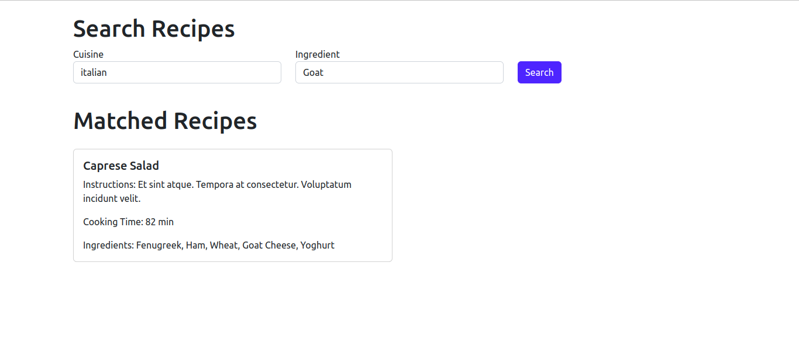

# README

This README would normally document whatever steps are necessary to get the
application up and running.

# Assignment

The application is a Digital Cookbook, a culinary recipes repository with simple
search capabilities with an HTML interface.

## Installation

This application uses the following Ruby and Rails version. 

Ruby version 

    ruby '3.1.1'

* System dependencies
  * Node Version 
    `16.16.0`

  * Npm Version 
    `8.11.0`

Rails version

    rails '7.0.6'

Follow these easy steps to install and start the app:

First, install the gems required by the application:

    bundle

Next, execute the database migrations/schema setup:

    bundle exec rake db:setup

OR execute the database setup with following commands:

    bundle exec rake db:create

    bundle exec rake db:migrate

Next, execute the seed file to create some dummy data:

    bundle exec rake db:seed

### Start the app

Start the Rails server:

    bundle exec rails server OR rails s

We can check the landing page at

    http://localhost:3000

Here's a screenshot of the application in action:

### Test cases

To execute the test cases, run this command: 

    bundle exec rspec
